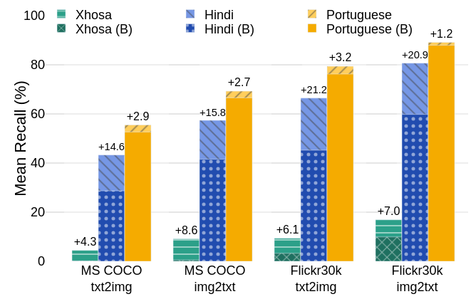

#  CAPIVARA: Cost-Efficient Approach for Improving Multilingual CLIP Performance on Low-Resource Languages

[](https://arxiv.org/abs/2310.13683)

In this project, we propose  CAPIVARA, a cost-efficient framework
designed to enhance the performance of multilingual CLIP models in low-resource languages. Our framework are built upon
pre-trained [OpenCLIP](https://github.com/mlfoundations/open_clip/tree/main#openclip), and it implements the
conventional fine-tuning and also an optimized fine-tuning (CAPIVARA + Opt.) that uses LoRA and gradient checkpointing in order to reduce 
the computation cost.

 CAPIVARA holds the state of the art in many zero-shot tasks involving 
images and Portuguese texts. Also, our method has the potential of significantly improve the model performance in other 
low-resource languages using a single RTX Quadro 8000 GPU for just 2 hours.

## Pipeline


In our pipeline, we employed the following models:

+ **Translator**: Google Translate
+ **Image captioning**: [BLIP2](https://huggingface.co/Salesforce/blip2-opt-2.7b-coco)

## Results

|                                                                                                                                                                                                                                                                                                                                                                        |
|-----------------------------------------------------------------------------------------------------------------------------------------------------------------------------------------------------------------------------------------------------------------------------------------------------------------------------------------------------------------------------------------------------------------|
| Performance improvement with CAPIVARA + Opt. in Low-Resource Languages: Xhosa, Hindi, and Portuguese. The percentage point increase over the baseline ([OpenCLIP ViT-B/32 XLM-Roberta Base](https://huggingface.co/laion/CLIP-ViT-B-32-xlm-roberta-base-laion5B-s13B-b90k)) in terms of mean recall for text-to-image (txt2img) and image-to-text (img2txt) retrieval is highlighted above the respective bars. |


|Model| Flickr30k
## Reproducibility

### Installation Requirements
Run the following command to install required packages.

```bash
pip install -r requirements.txt
```

### Code organization

### Data preprocessing
#### Dataset Translation

Since the texts used are translated from English into the target languages, if it is necessary to introduce new data in addition to the data provided by us, a new translation is required. We used Google Translate to do this. First, we extracted all the captions for each of the sets used. Then we translated the captions using the translator. Finally, we added all the translated captions to their original bases with the tag of the language used. All sets are kept in the original format of the bases to make it easier for users who already use them.

### Train

CAPIVARA is built using [pytorch-lightning](https://lightning.ai/docs/pytorch/stable/). The file [example.yaml](https://github.com/hiaac-nlp/CAPIVARA/blob/main/clip_pt/experiment_setup/example.yaml) lists all the parameters that can be used by CAPIVARA.

For simple and straightforward training of the model, the following command can be used:
```bash
python3 CLIP-PtBr/clip_pt/src/main_open_clip.py \
		--config_path=path/to/config_file
```
To use the adapter training settings, you must also pass on the directory of the checkpoint used:
```bash
python3 CLIP-PtBr/clip_pt/src/main_open_clip.py \
		--config_path=path/to/config_file
		--checkpoint-dir=path/to/checkpoint \
```
Other settings (all present in the file [example.yaml](https://github.com/hiaac-nlp/CAPIVARA/blob/main/clip_pt/experiment_setup/example.yaml) are available to configure the training and import according to your needs.

### Inference
In order to make easier to replicate our experiments, we share the scripts we used for inference.

#### Zero-shot cross-modal retrieval
CAPIVARA can be used to retrieve or classify both modals, images and texts.

#### Image Retrieval

The following method can be used to retrieve images:

```python
def text_to_image_retrieval(text_required, model, image_features, text_features, all_images, all_texts):
    all_texts = sum(all_texts, [])
    caption = []
    for text in text_required:
        if type(text) != int:
            caption.append(text)
            text_features = text_tokenizer(text)
            text_features = model.encode_text(text_features.to(device))
            text_features = text_features
        else:
            caption.append([text])
        similarities = []
        for i in tqdm.tqdm(range(len(image_features)), desc="t2i retrieval"):
            if type(text) == int:
                scores = text_features[text] @ image_features[i].t()  # shape: [batch_size, batch_size]
            else:
                scores = text_features @ image_features[i].t()  # shape: [batch_size, batch_size]
            item = {
                'score': scores.cpu(),
                'id': i,
                'image': all_images[i].cpu()
            }
            similarities.append(item)
        similarities_df = pd.DataFrame(similarities)
        sorted_similarities_df = similarities_df.sort_values(by='score', ascending=False)
    return sorted_similarities_df, caption
```

In this way, a list containing the similarity scores between the input text and the set of images is returned, as well as their ids and images.

#### Text Retrieval
As a complement, the method below retrieves text from a target image.

```python
def image_to_text_retrieval(image_required, image_features, text_features, all_images, all_texts):
    all_texts = sum(all_texts, [])
    images_selected = []
    for image in image_required:
        images_selected.append(all_images[image])
        similarities = []
        for i in tqdm.tqdm(range(len(text_features)), desc="i2t retrieval"):
            scores = text_features[i] @ image_features[image].t()  # shape: [batch_size, batch_size]
            item = {
                'score': scores.cpu(),
                'id': i,
                'text': all_texts[i]
            }
            similarities.append(item)
        similarities_df = pd.DataFrame(similarities)
        sorted_similarities_df = similarities_df.sort_values(by='score', ascending=False)
    return sorted_similarities_df, images_selected
```

This method returns a list containing the similarity scores between the input image and the set of texts, as well as their ids and images.
The use of these methods and other auxiliary methods can also be seen in the [retrieval example notebook](link), where it is possible to iteratively retrieve images and texts.

#### Retrieval Evaluation

To carry out the evaluation of image and text retrieval automatically, generating the metrics used in the article, the python script [zero_shot_retrieval_clip_benchmark.py](https://github.com/hiaac-nlp/CAPIVARA/blob/main/clip_pt/src/evaluate/zero_shot_retrieval_clip_benchmark.py) can be used.
The following parameters can be used:

```bash
--model-path, directs to the path of the model checkpoint
--distill, to use knowledge distillation
--dataset-path, path to validation/test dataset
--translation, select which translation framework will be used "english", "marian", "google" (default)
--language, language used for captions: "en" (default), "xh", "hi"
--batch, batch size
--open_clip, indicates whether model is fine-tuned (True) or is the original OpenCLIP (False)")
--gpu, select GPU
--adapter, load the adapter weights
```

#### Zero-shot image classification
To use the model as a classifier, the following code can be used:

```python
img_features, txt_features = model.model(batch)
logits, _ = model.model.compute_logits(
                img_features,
                txt_features,
                fixed_logit=False
            )  # shape: [n_imgs, n_classes]
predictions = torch.argsort(logits, descending=True)
predicted_labels = predictions[:, :k]

# Check if the target label is in the top-k predictions for each sample
correct_predictions = (predicted_labels == targets.view(-1, 1)).any(dim=1)

```

The predictions return the correct predictions relating the classified image and text. We then check the first k correctly classified values.
An [classification example notebook](link) for classifying images and text is also available.

## Citation
```bibtex
@inproceedings{capivara,
  title={CAPIVARA: Cost-Efficient Approach for Improving Multilingual CLIP Performance on Low-Resource Languages},
  ...
}
`